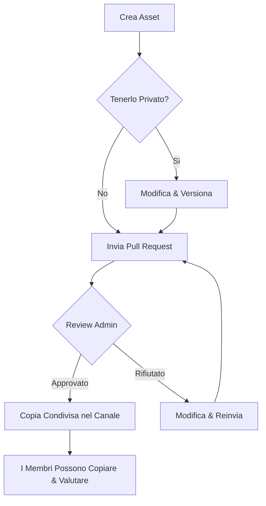
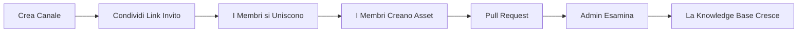

# AI Teams Config Hub

Una piattaforma web per team tecnici che permette di organizzare, condividere e gestire configurazioni AI in uno spazio di lavoro collaborativo.

**[Accedi all'app](https://my-ai-teams-config-hub.vercel.app)**

---

## Cos'e AI Teams Config Hub?

AI Teams Config Hub e una piattaforma collaborativa pensata per sviluppatori, DevOps engineer e AI engineer che lavorano con Claude e altri LLM. Permette di:

- Caricare, organizzare e versionare le proprie configurazioni AI (skill, prompt, system prompt, configurazioni MCP server, guide how-to)
- Condividere le configurazioni con il team attraverso un processo di review moderato
- Mantenere standard qualitativi con la condivisione approvata dall'admin tramite pull request
- Tracciare le modifiche nel tempo con cronologia versioni e visualizzazione diff integrata

E un registro privato per il tooling AI del tuo team, con workflow di review simili alle pull request di GitHub.

---

## Concetti Chiave

### Canali

Un **canale** e lo spazio di lavoro del tuo team. Ogni canale e isolato e comprende:

- Un **admin** (chi lo ha creato) che modera i contenuti
- **Membri** che possono creare, condividere e copiare configurazioni
- Una pagina **README** privata (editabile dall'admin) per le linee guida del team
- Un **feed attivita** che mostra tutto cio che accade nel canale

### Tipi di Asset

| Tipo | Descrizione |
|------|-------------|
| Skill | File Markdown che estendono le capacita di Claude |
| MCP Server Config | Configurazioni JSON/YAML per server Model Context Protocol |
| How-to | Guide tecniche passo-passo in Markdown |
| Prompt Template | Prompt riutilizzabili per task comuni |
| System Prompt | System prompt completi per progetti Claude |

### Visibilita e Condivisione

Ogni asset nasce come **privato** (visibile solo a te). Per condividerlo con il canale:

1. Invia una **Pull Request** dal tuo asset
2. L'admin del canale la esamina (con anteprima diff)
3. Se approvata, una copia condivisa appare nel canale per tutti i membri
4. Tu mantieni la tua copia privata e puoi continuare a modificarla indipendentemente

---

## Primi Passi

### 1. Crea un Account

Registrati con il tuo indirizzo email. Riceverai una email di verifica - clicca il link per attivare l'account.

### 2. Crea o Unisciti a un Canale

Dopo aver verificato l'email, hai due opzioni:

- **Crea un canale** - diventi l'admin e puoi invitare altri
- **Unisciti a un canale** - usa un link di invito condiviso da un membro o admin esistente

### 3. Crea il Tuo Primo Asset

1. Clicca **Nuovo Asset** nella sidebar
2. Scegli il tipo di asset (skill, prompt, MCP config, ecc.)
3. Scrivi il contenuto nell'editor di codice integrato (stesso editor di VS Code)
4. Aggiungi titolo, descrizione e tag
5. Salva - il tuo asset e ora nel tuo spazio privato

### 4. Condividi con il Team

1. Apri uno dei tuoi asset privati
2. Clicca **Richiedi Condivisione**
3. L'admin del canale riceve la tua pull request
4. Una volta approvato, l'asset appare nella sezione condivisa per tutti i membri

---

## Guida alle Funzionalita

### Editor

L'editor integrato supporta syntax highlighting per Markdown, JSON e YAML. Offre la stessa esperienza di editing di VS Code, inclusi:

- Syntax highlighting e auto-indentazione
- Matching e chiusura automatica delle parentesi
- Cerca e sostituisci
- Cursori multipli

### Cronologia Versioni

Ogni modifica crea una nuova versione. Puoi:

- Visualizzare la cronologia completa delle modifiche
- Vedere le diff tra due versioni qualsiasi
- Capire chi ha modificato cosa e quando

### Ricerca e Filtri

Trova gli asset velocemente usando:

- **Ricerca full-text** su titoli, descrizioni e contenuti
- **Filtri** per tipo di asset (skill, prompt, MCP config, ecc.)
- **Filtri** per stato (bozza, in attesa, approvato, rifiutato)
- **Ordinamento** per data, rating o numero di copie

### Rating

Valuta gli asset condivisi con un punteggio da 1 a 5 stelle per aiutare il team a identificare le configurazioni migliori.

### Contatore Copie

Vedi quante volte un asset condiviso e stato copiato dai membri del team - un buon indicatore di utilita.

### Import/Export

- **Import** di un singolo file o di un archivio `.zip` contenente piu asset
- **Export** degli asset condivisi del canale come file `.zip` con metadati completi

### Command Palette

Premi `Cmd+K` (o `Ctrl+K`) per aprire la command palette e navigare rapidamente tra pagine e azioni.

---

## Ruoli Utente

### Membro

- Creare e gestire asset personali
- Inviare pull request per condividere asset
- Copiare asset condivisi nel proprio spazio
- Valutare asset condivisi
- Visualizzare il feed attivita del canale

### Admin (Creatore del Canale)

Tutto cio che puo fare un membro, piu:

- Esaminare e approvare/rifiutare pull request
- Rimuovere membri dal canale
- Modificare il README del canale
- Rigenerare il link di invito
- Esportare tutti gli asset condivisi
- Trasferire il ruolo admin a un altro membro

---

## Diagramma del Workflow

---

## Ciclo di Vita del Canale

---

## Domande Frequenti

**Posso appartenere a piu canali?**
Si. Puoi creare o unirti a quanti canali vuoi. Passa da uno all'altro dalla sidebar.

**Cosa succede se l'admin se ne va?**
L'admin puo trasferire la proprieta a un altro membro prima di andarsene. Usa il pulsante "Trasferisci Admin" nella pagina Membri.

**I miei asset privati sono visibili all'admin?**
No. Gli asset privati sono visibili solo a te. L'admin puo vedere solo gli asset che sono stati condivisi attraverso il processo di pull request.

**Posso modificare un asset condiviso?**
Modifichi la tua copia privata. Per aggiornare la versione condivisa, invia una nuova pull request con le tue modifiche.

**Quali formati di file sono supportati?**
Markdown (`.md`), JSON (`.json`), YAML (`.yaml`) e testo semplice. L'editor rileva automaticamente il linguaggio dal tipo di asset.

**C'e un limite di dimensione file?**
Si, il caricamento di singoli file e limitato a 5 MB. L'import zip e limitato a 10 MB.

---

## Supporto

Per segnalazioni o richieste di funzionalita, apri una issue in questo repository.

---

## Licenza

Vedi [LICENSE](./LICENSE) per i dettagli. Questo software e fornito come servizio hosted. Il codice sorgente non e pubblicamente disponibile.
