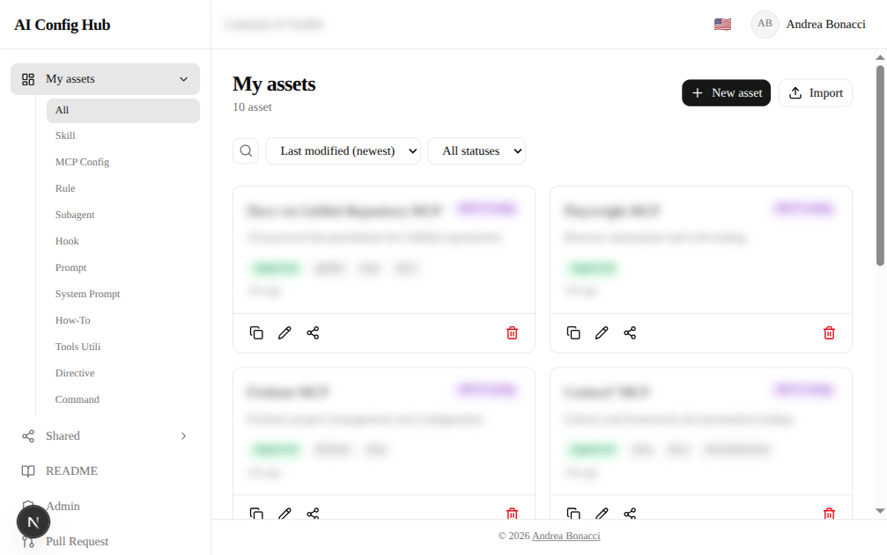
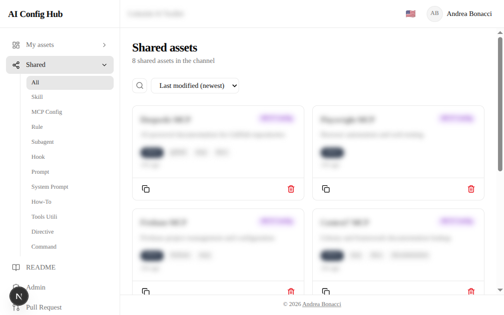
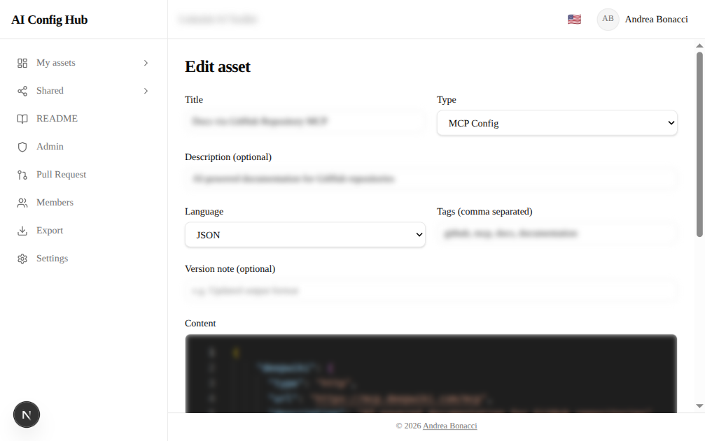
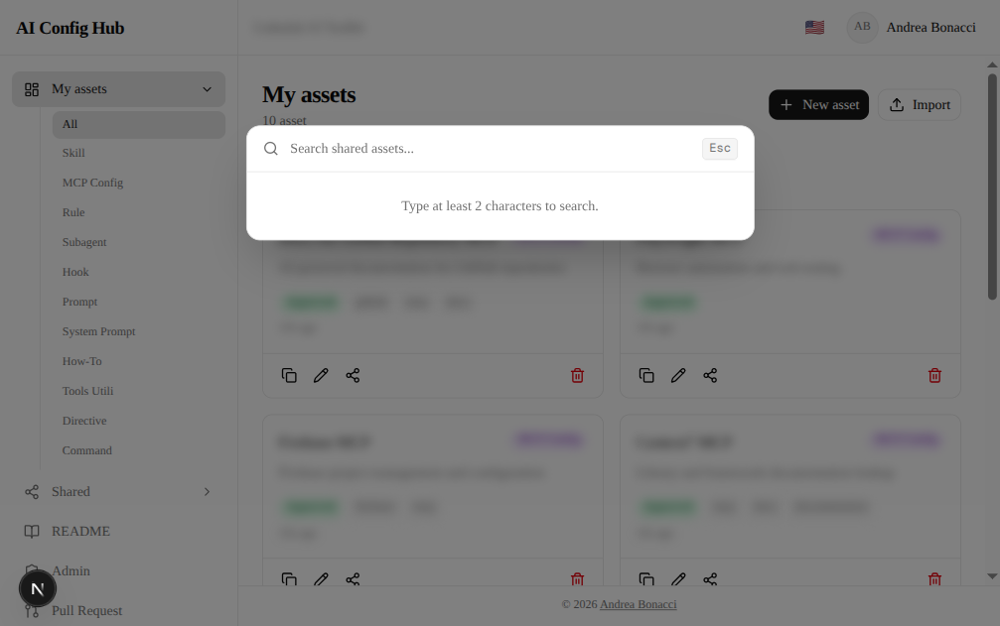
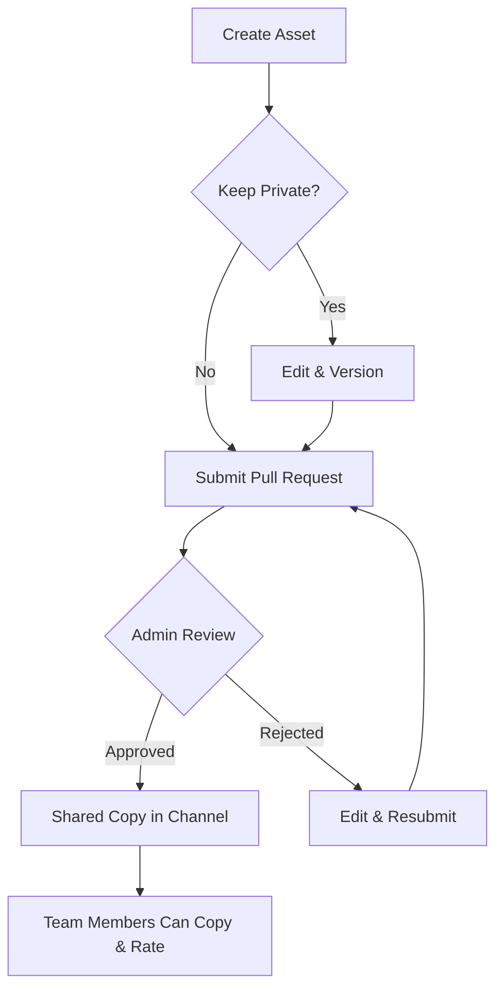
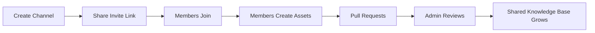

> **Italiano:** [Leggi in italiano](./README.it.md)
>
> **Docs:** [Architecture](./readme-tech-architecture.md) | [Security](./readme-tech-security.md)

# AI Teams Config Hub

A web platform for technical teams to organize, share, and manage AI configurations in a collaborative workspace.

**[Access the app](https://my-ai-teams-config-hub.vercel.app)**

---

## What is AI Teams Config Hub?

AI Teams Config Hub is a collaborative platform designed for developers, DevOps engineers, and AI engineers who work with Claude and other LLMs. It lets you:

- Upload, organize, and version your AI configurations (skills, prompts, system prompts, MCP server configs, how-to guides)
- Share configurations with your team through a moderated review process
- Maintain quality standards with admin-approved sharing via pull requests
- Track changes over time with built-in version history and diff views

Think of it as a private registry for your team's AI tooling, with review workflows similar to GitHub pull requests.

---

## Key Concepts

### Channels

A **channel** is your team's workspace. Each channel is isolated and has:

- An **admin** (the person who created it) who moderates content
- **Members** who can create, share, and copy configurations
- A private **README** page (editable by admin) for team guidelines
- An **activity feed** showing everything that happens in the channel

### Asset Types

| Type | Description |
|------|-------------|
| Skill | Markdown files that extend Claude's capabilities |
| MCP Server Config | JSON/YAML configurations for Model Context Protocol servers |
| How-to | Step-by-step technical guides in Markdown |
| Prompt Template | Reusable prompts for common tasks |
| System Prompt | Complete system prompts for Claude projects |

### Visibility and Sharing

Every asset starts as **private** (visible only to you). To share it with your channel:

1. Submit a **Pull Request** from your asset
2. The channel admin reviews it (with a diff preview)
3. If approved, a shared copy appears in the channel for all members
4. You keep your private copy and can continue editing independently

---

## Getting Started

### 1. Create an Account

Sign up with your email address. You will receive a verification email - click the link to activate your account.

### 2. Create or Join a Channel

After verifying your email, you have two options:

- **Create a channel** - you become the admin and can invite others
- **Join a channel** - use an invite link shared by an existing member or admin

### 3. Create Your First Asset

1. Click **New Asset** in the sidebar
2. Choose the asset type (skill, prompt, MCP config, etc.)
3. Write your content in the built-in code editor (same editor as VS Code)
4. Add a title, description, and tags
5. Save - your asset is now in your private space

### 4. Share with Your Team

1. Open any of your private assets
2. Click **Request Share**
3. The channel admin receives your pull request
4. Once approved, the asset appears in the shared section for all members

---

## Screenshots

### Dashboard

### Shared Assets

### Asset Editor

### Command Palette

---

## Features Guide

### Editor

The built-in editor supports syntax highlighting for Markdown, JSON, and YAML. It provides the same editing experience as VS Code, including:

- Syntax highlighting and auto-indentation
- Bracket matching and auto-closing
- Search and replace
- Multiple cursors

### Version History

Every edit creates a new version. You can:

- View the complete history of changes
- See diffs between any two versions
- Understand who edited what and when

### Search and Filters

Find assets quickly using:

- **Full-text search** across titles, descriptions, and content
- **Filters** by asset type (skill, prompt, MCP config, etc.)
- **Filters** by status (draft, pending, approved, rejected)
- **Sort** by date, rating, or copy count

### Ratings

Rate shared assets on a 5-star scale to help your team identify the best configurations.

### Copy Count

See how many times a shared asset has been copied by team members - a good indicator of usefulness.

### Import/Export

- **Import** a single file or a `.zip` archive containing multiple assets
- **Export** your channel's shared assets as a `.zip` file with full metadata

### Command Palette

Press `Cmd+K` (or `Ctrl+K`) to open the command palette for quick navigation between pages and actions.

---

## User Roles

### Member

- Create and manage personal assets
- Submit pull requests to share assets
- Copy shared assets to personal space
- Rate shared assets
- View channel activity feed

### Admin (Channel Creator)

Everything a member can do, plus:

- Review and approve/reject pull requests
- Remove members from the channel
- Edit the channel README
- Regenerate the invite link
- Export all shared assets
- Transfer admin role to another member

---

## Workflow Diagram

---

## Channel Lifecycle

---

## FAQ

**Can I belong to multiple channels?**
Yes. You can create or join as many channels as you need. Switch between them from the sidebar.

**What happens if the admin leaves?**
The admin can transfer ownership to another member before leaving. Use the "Transfer Admin" button in the Members page.

**Are my private assets visible to the admin?**
No. Private assets are visible only to you. The admin can only see assets that have been shared through the pull request process.

**Can I edit a shared asset?**
You edit your private copy. To update the shared version, submit a new pull request with your changes.

**What file formats are supported?**
Markdown (`.md`), JSON (`.json`), YAML (`.yaml`), and plain text. The editor auto-detects the language from the asset type.

**Is there a file size limit?**
Yes, individual file uploads are limited to 5 MB. Zip imports are limited to 10 MB.

---

## Support

For issues or feature requests, open an issue in this repository.

---

## License

See [LICENSE](./LICENSE) for details. This software is provided as a hosted service. The source code is not publicly available.
