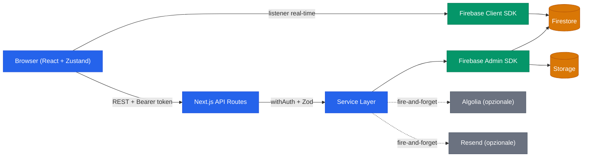
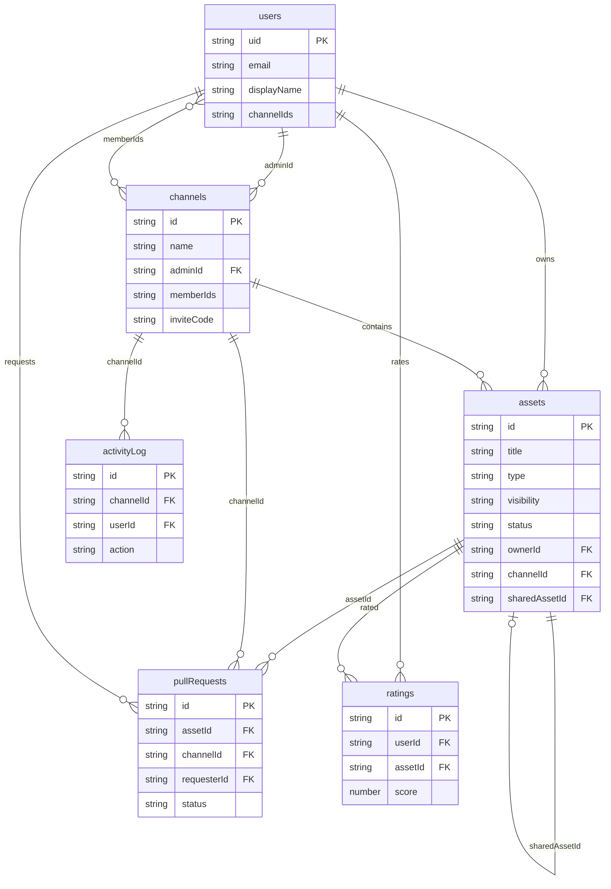
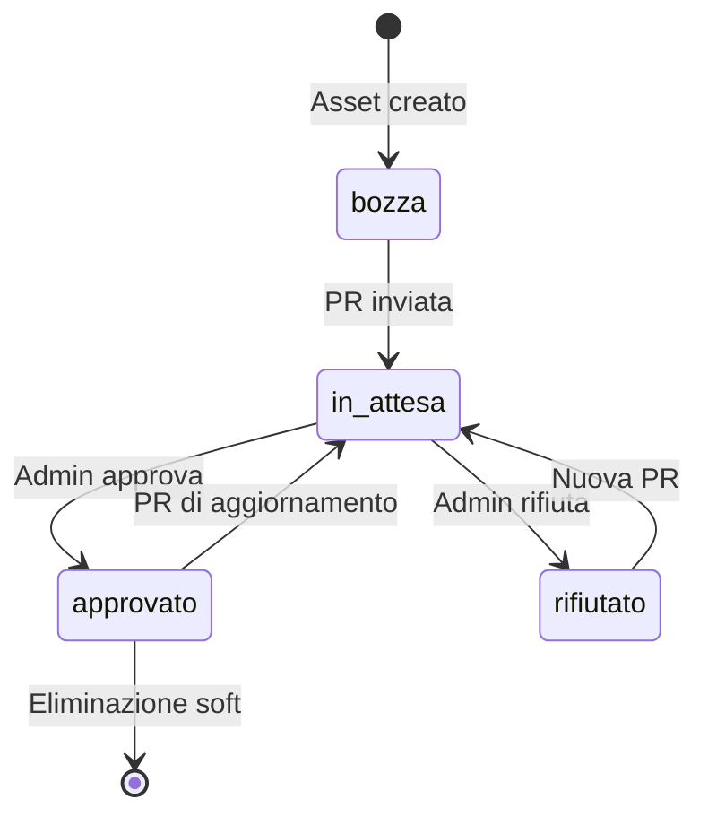
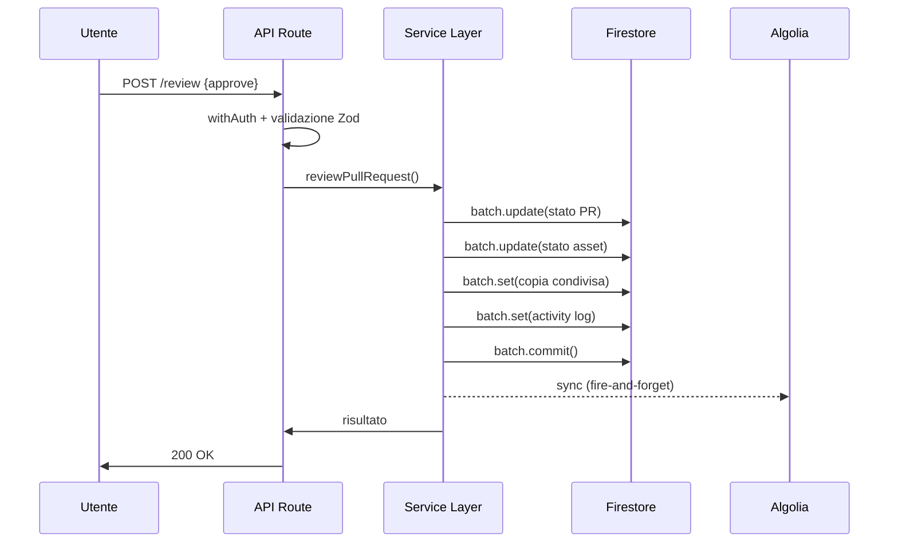
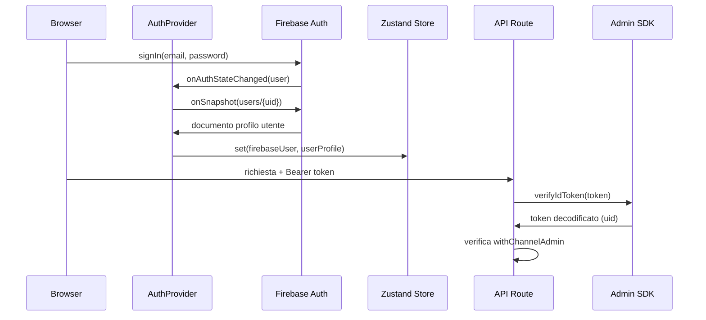
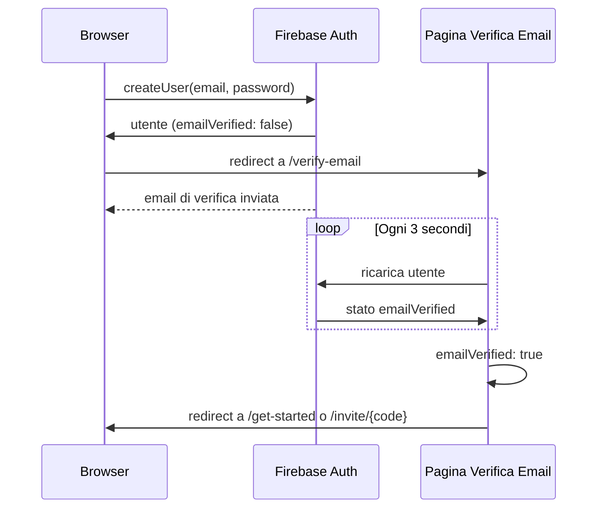

# Architettura

Riferimento tecnico per gli interni di AI Teams Config Hub.

## Panoramica del sistema

Il browser comunica con Firebase direttamente per i dati real-time (listener Firestore) e con le API Routes di Next.js per le mutazioni che richiedono validazione server-side. Le API Routes sono thin handler: auth guard, validazione Zod, chiamata al service, response HTTP. Il service layer contiene tutta la business logic e usa Firebase Admin SDK per operazioni batch su Firestore. Algolia e Resend sono integrazioni opzionali, fire-and-forget.

## Modello dati

Collezioni Firestore e relative relazioni. Gli array (`channelIds`, `memberIds`) sono campi array di Firestore.

Relazioni chiave:

- **Pattern dual-asset**: quando una PR viene approvata, viene creata una copia condivisa separata. L'asset originale punta alla copia tramite `sharedAssetId`, e la copia referenzia la sorgente tramite `sourceAssetId`. L'owner continua a modificare la copia privata indipendentemente.
- **Ratings**: chiave composta `{userId}_{assetId}` per evitare duplicati. Gli aggregati `rating.total`, `rating.count`, `rating.average` vengono aggiornati via transaction Firestore per evitare race condition.
- **Activity log**: scritto sempre nella stessa batch dell'operazione che lo genera, garantendo atomicita.

## Ciclo di vita degli asset

Un asset attraversa i seguenti stati, guidato dall'invio di PR e dalle review dell'admin.

- `bozza`: stato iniziale, privato per l'owner
- `in_attesa`: una PR e stata inviata, in attesa di review dall'admin
- `approvato`: l'admin ha approvato, una copia condivisa esiste nel canale
- `rifiutato`: l'admin ha rifiutato, l'owner puo reinviare
- La soft delete imposta `deletedByOwner: true` sulla copia privata; la copia condivisa resta visibile

## Flusso review pull request

Il flusso di approvazione e l'operazione piu complessa. Tutte le scritture su Firestore avvengono in un singolo batch atomico.

In caso di rifiuto, la batch aggiorna solo lo stato della PR e dell'asset (nessuna copia condivisa creata).

## Flusso di autenticazione

Auth lato client via Firebase, verifica token lato server via Admin SDK.

- `AuthProvider` ascolta i cambiamenti di stato Firebase Auth e sincronizza il profilo utente su Zustand
- Le API Routes estraggono il Bearer token dall'header Authorization e lo verificano con Admin SDK
- `withChannelAdmin` estende `withAuth` controllando `channel.adminId === uid`
- L'admin e per-canale, non globale: chi crea un canale ne diventa admin

## Flusso verifica email

Dopo la registrazione, gli utenti devono verificare la propria email prima di accedere all'app. La pagina di verifica email interroga Firebase Auth ogni 3 secondi e reindirizza al completamento.

- Se l'utente si e registrato tramite un invite link, il codice invito viene preservato come parametro query durante il flusso di verifica
- Gli utenti possono richiedere una nuova email di verifica (cooldown di 60 secondi tra i reinvii)
- La pagina offre un'opzione di logout per tornare al login

## Regole di sicurezza

Il controllo accessi e applicato sia a livello applicativo (guard nelle API route) che a livello database (regole di sicurezza Firestore e Storage).

### Regole Firestore

Ogni collezione ha vincoli specifici di lettura/scrittura definiti in `firestore.rules`:

| Collezione        | Lettura                         | Scrittura                        | Note                                                                       |
| ----------------- | ------------------------------- | -------------------------------- | -------------------------------------------------------------------------- |
| `users`           | Solo proprietario               | Solo proprietario                | Eliminazione non consentita                                                |
| `channels`        | Solo membri                     | Solo admin (aggiornamento)       | Chiunque autenticato puo creare                                            |
| `assets`          | Basata sulla visibilita         | Proprietario o admin             | Aggiornamento `copyCount` vincolato al solo incremento da qualsiasi membro |
| `assets/versions` | Proprietario o admin del canale | Solo proprietario (creazione)    | Immutabili dopo la creazione                                               |
| `pullRequests`    | Richiedente o admin del canale  | Admin del canale (aggiornamento) | Eliminazione non consentita                                                |
| `activityLog`     | Membri del canale               | Solo creatore                    | Immutabili dopo la creazione                                               |
| `ratings`         | Proprietario del rating         | Proprietario del rating          | Chiave composta `{userId}_{assetId}` applicata                             |

Le funzioni helper `isAuth()`, `isMemberOf(channelId)`, `isChannelAdmin(channelId)` e `isOwner(resource)` centralizzano i controlli di autorizzazione.

### Regole Storage

Gli upload file in `storage.rules` sono limitati a:

- Utenti autenticati che sono membri del canale di destinazione
- Dimensione massima file: 5 MB
- Content type consentiti: `text/*`, `application/json`, `application/zip`
