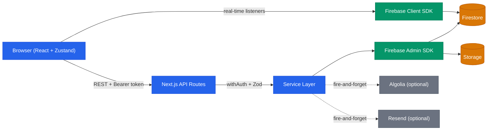
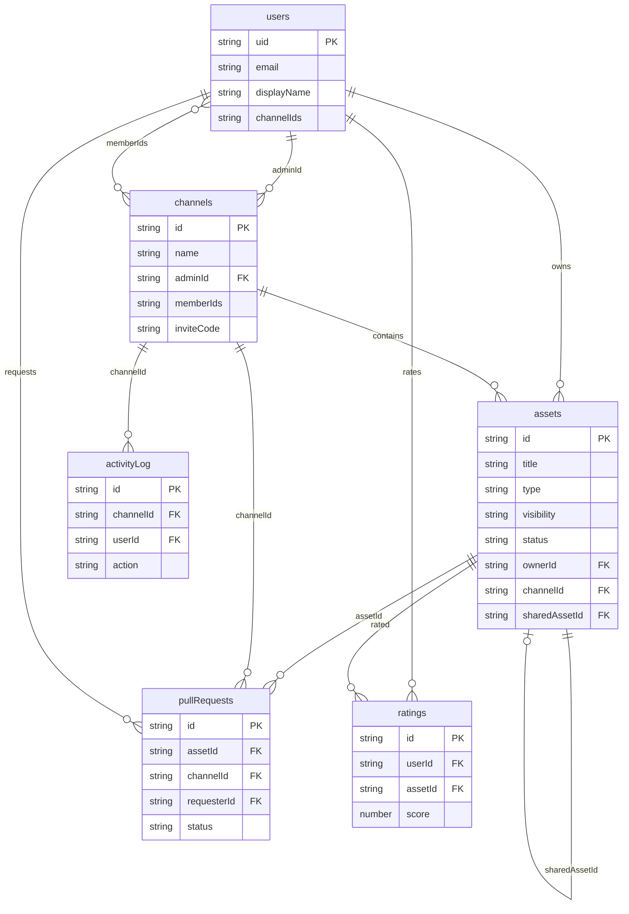
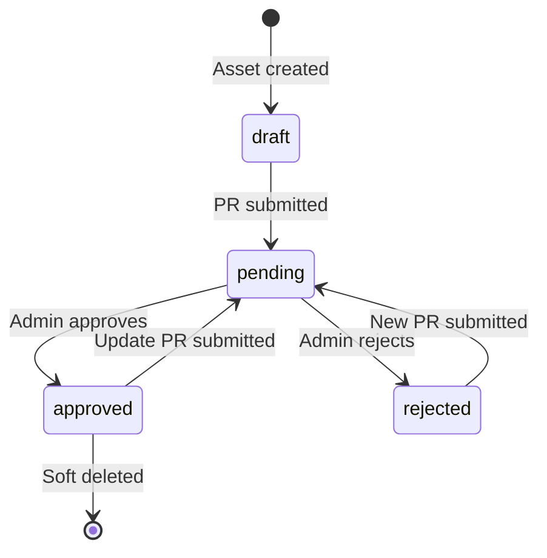
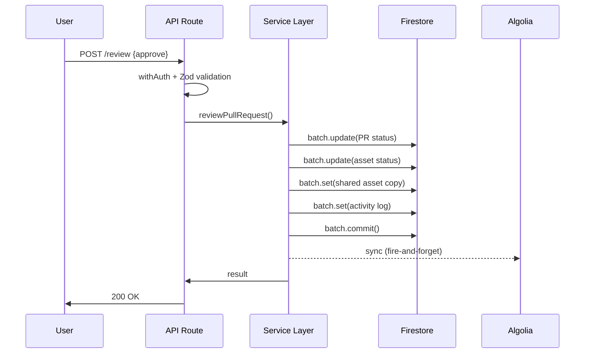
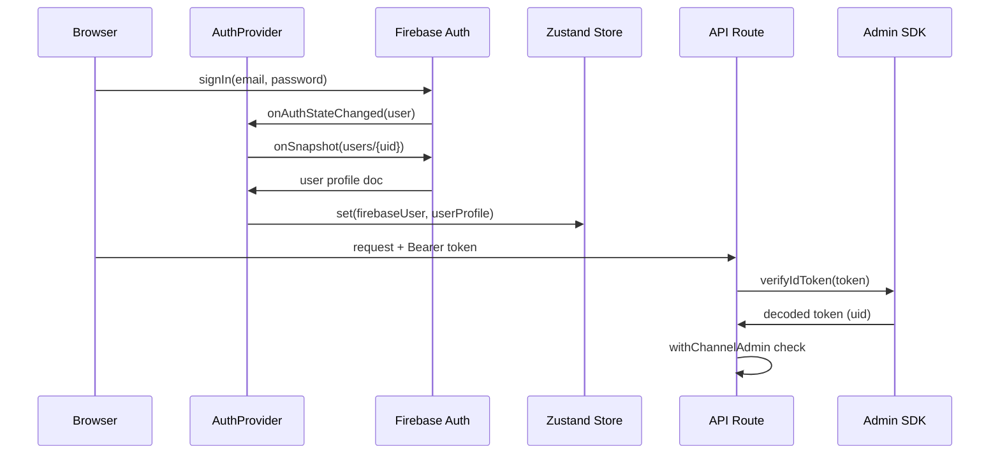
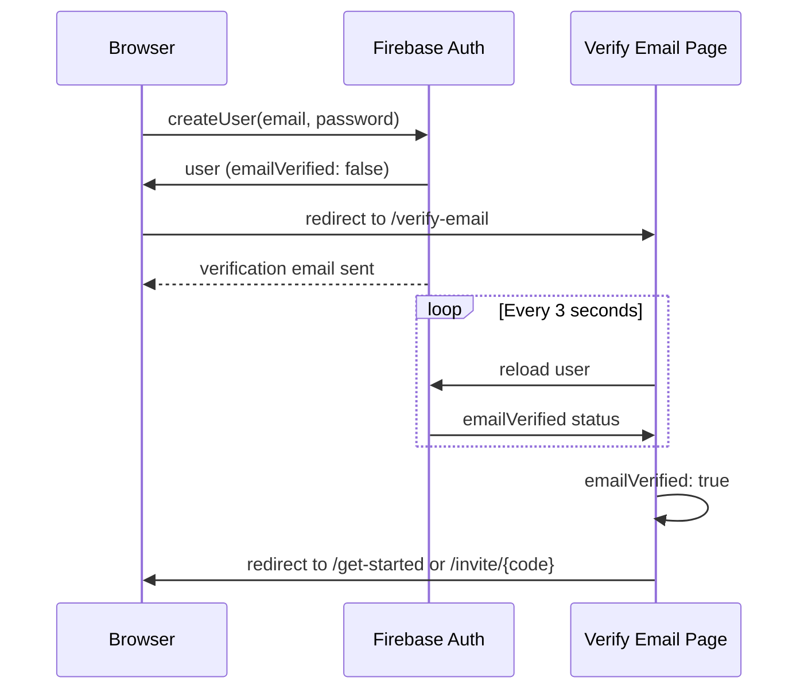

# Architecture

Technical reference for AI Teams Config Hub internals.

## System overview

The browser communicates with Firebase directly for real-time data (Firestore listeners) and with Next.js API Routes for mutations that require server-side validation. API Routes are thin handlers: auth guard, Zod validation, service call, HTTP response. The service layer contains all business logic and uses Firebase Admin SDK for Firestore batch operations. Algolia and Resend are optional, fire-and-forget integrations.

## Data model

Firestore collections and their relationships. Arrays (`channelIds`, `memberIds`) are stored as Firestore array fields.

Key relationships:

- **Dual-asset pattern**: when a PR is approved, a separate shared copy is created. The original asset links to the copy via `sharedAssetId`, and the copy references the source via `sourceAssetId`. This allows the owner to keep editing their private copy independently.
- **Ratings**: compound key `{userId}_{assetId}` prevents duplicates. Aggregate `rating.total`, `rating.count`, `rating.average` are updated via Firestore transaction to avoid race conditions.
- **Activity log**: always written as part of the same batch as the triggering operation, ensuring atomicity.

## Asset lifecycle

An asset goes through the following states, driven by PR submissions and admin reviews.

- `draft`: initial state, private to the owner
- `pending`: a PR has been submitted, awaiting admin review
- `approved`: admin approved, a shared copy exists in the channel
- `rejected`: admin rejected, owner can resubmit
- Soft delete sets `deletedByOwner: true` on the private copy; the shared copy remains visible

## Pull request review flow

The approval flow is the most complex operation. All Firestore writes happen in a single atomic batch.

On rejection, the batch updates only the PR and asset status (no shared copy created).

## Authentication flow

Client-side auth via Firebase, server-side token verification via Admin SDK.

- `AuthProvider` listens to Firebase Auth state changes and syncs the user profile to Zustand
- API Routes extract the Bearer token from the Authorization header and verify it with Admin SDK
- `withChannelAdmin` extends `withAuth` by checking `channel.adminId === uid`
- Admin is per-channel, not global: whoever creates a channel becomes its admin

## Email verification flow

After registration, users must verify their email before accessing the app. The verify-email page polls Firebase Auth every 3 seconds and redirects on success.

- If the user registered via an invite link, the invite code is preserved as a query parameter through the verification flow
- Users can request a new verification email (60-second cooldown between resends)
- The page provides a sign-out option to return to login

## Security rules

Access control is enforced at both the application layer (API route guards) and the database layer (Firestore and Storage security rules).

### Firestore rules

Each collection has specific read/write constraints defined in `firestore.rules`:

| Collection        | Read                       | Write                  | Notes                                                          |
| ----------------- | -------------------------- | ---------------------- | -------------------------------------------------------------- |
| `users`           | Owner only                 | Owner only             | No deletes allowed                                             |
| `channels`        | Members only               | Admin only (update)    | Anyone authenticated can create                                |
| `assets`          | Visibility-based           | Owner or admin         | `copyCount` update constrained to increment-only by any member |
| `assets/versions` | Owner or channel admin     | Owner only (create)    | Immutable after creation                                       |
| `pullRequests`    | Requester or channel admin | Channel admin (update) | No deletes allowed                                             |
| `activityLog`     | Channel members            | Creator only           | Immutable after creation                                       |
| `ratings`         | Rating owner               | Rating owner           | Compound key `{userId}_{assetId}` enforced                     |

Helper functions `isAuth()`, `isMemberOf(channelId)`, `isChannelAdmin(channelId)`, and `isOwner(resource)` centralize authorization checks.

### Storage rules

File uploads in `storage.rules` are restricted to:

- Authenticated users who are members of the target channel
- Maximum file size: 5 MB
- Allowed content types: `text/*`, `application/json`, `application/zip`
